# Mercury's Perihelion Precession: Numerical Study

*Individual project · AE 442 · Izmir University of Economics · May 2026*

## Engineering question
Can Mercury's observed perihelion precession be reproduced numerically and attributed to its physical sources?

## Approach
- One-century integration of the equations of motion.
- Planetary perturbations (rings of mass), the general-relativistic correction and solar oblateness added sequentially.
- A spurious numerical baseline from finite-difference truncation characterised and subtracted from every run.

## Results
- Total precession of 573.5 arcsec/century against 574.8 observed (0.22%).

## Validation
Benchmark comparison; residual attributed to omitting Uranus and Neptune.

## Figures
Figures are taken from the report (figure numbers and captions as in the report). The PDF originals are kept in `figures/` next to each PNG.

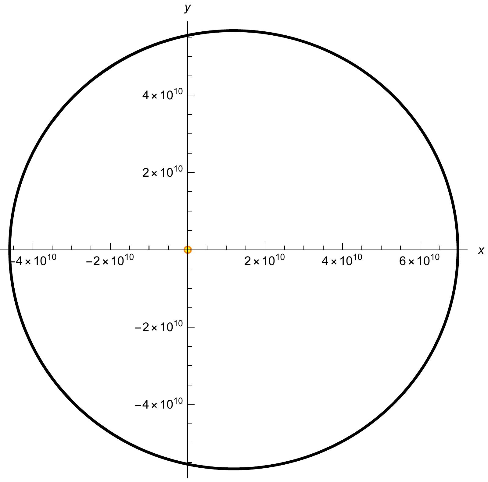
*Figure 1: Mercury's numerically integrated trajectory (black) around the Sun (orange disk) for 1 % of one century. The orbit is visually circular at this scale.*

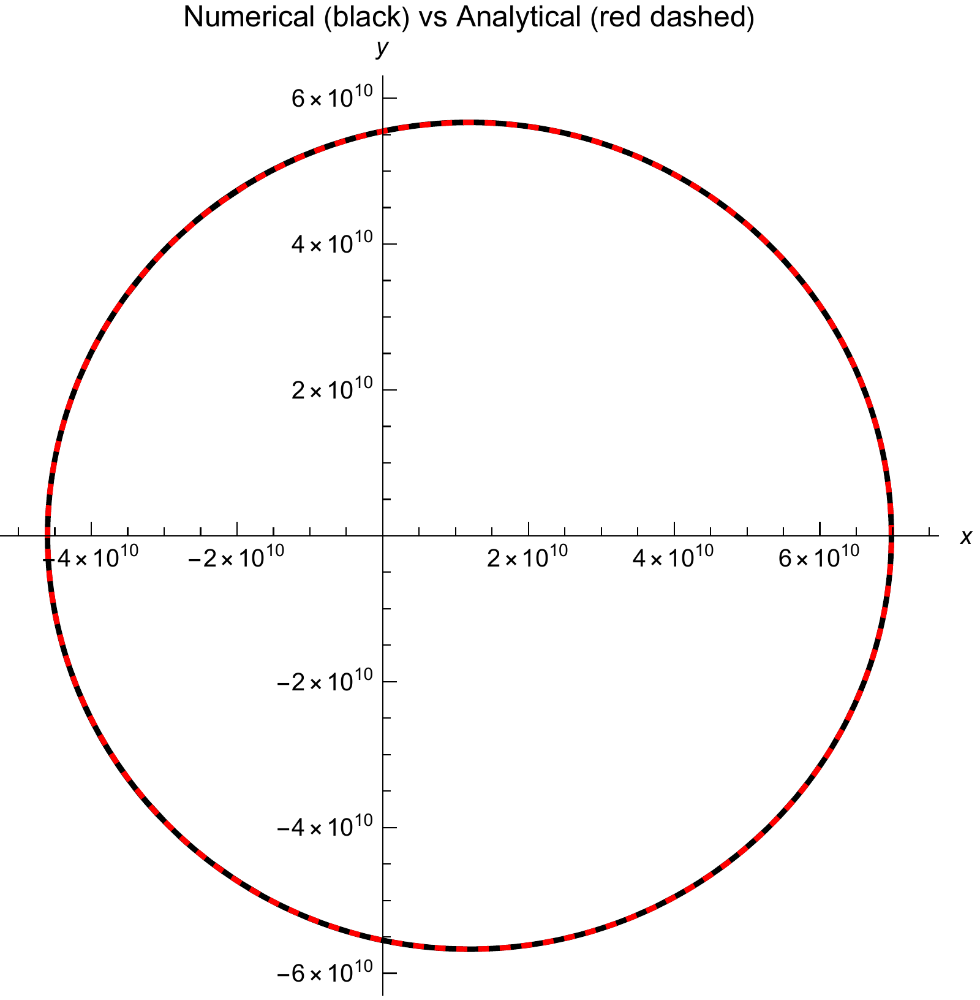
*Figure 2: Overlay of the numerical trajectory (black) and the analytical Keplerian solution (green dashed) in Cartesian coordinates. Long-term divergence from the closed ellipse is the baseline numerical precession.*

*Figure 3: Planetary-perturbed precession result from Mathematica: 530.7″/century (non-relativistic).*

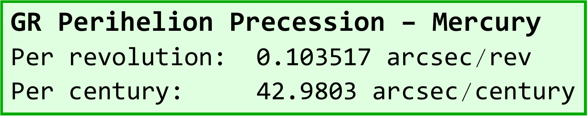
*Figure 4: GR precession result from Mathematica: per revolution 0.1035″, per century 42.98″ (analytical) and 42.81″ (numerical).*

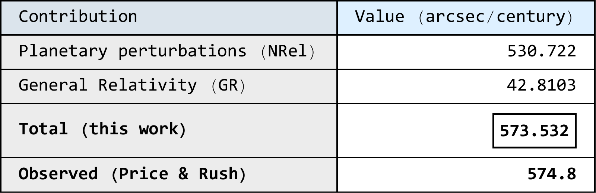
*Figure 5: Mathematica output: total precession summary table combining planetary and GR contributions.*

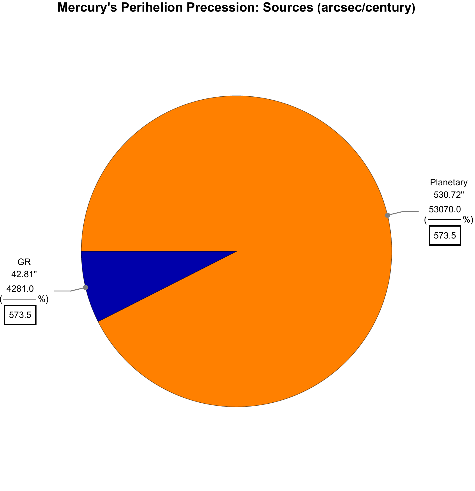
*Figure 6: Pie chart: non-relativistic (≈ 92.5 %) vs. GR (≈ 7.5 %) share of the total precession.*

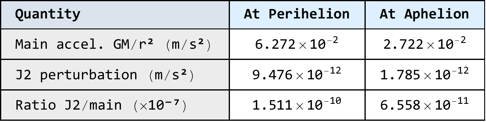
*Figure 7: J2 perturbation magnitude at Mercury's perihelion and aphelion versus the main gravitational acceleration; ratio ≈ 10⁻¹⁰.*

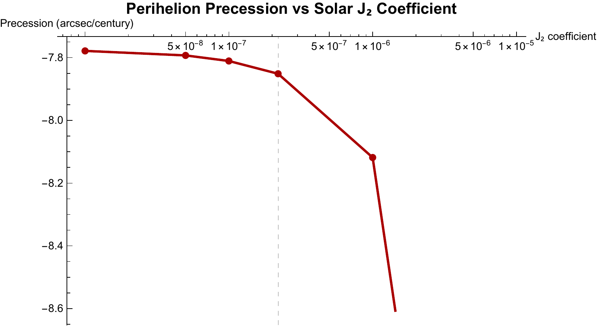
*Figure 8: Parametric sweep of J2: the contribution reaches 43″/century only at J2 ≈ 10⁻⁴, three orders above the physical value.*

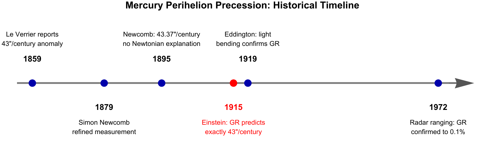
*Figure 9: Historical timeline of Mercury's perihelion anomaly: Le Verrier (1859) → Newcomb (1895) → Einstein GR (1915) → radar ranging confirmation (1972).*

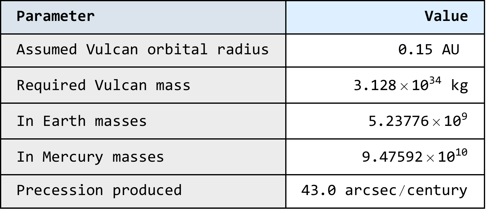
*Figure 10: Vulcan parameter summary: the required mass of 5.24 × 10⁹ M⊕ at aV = 0.15 AU is physically impossible.*

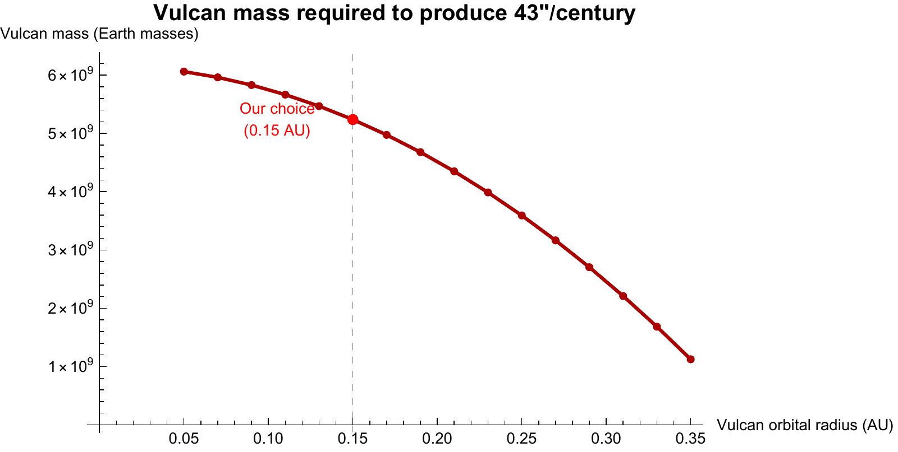
*Figure 11: Required Vulcan mass vs. assumed orbital radius aV: all solutions are unphysically large.*

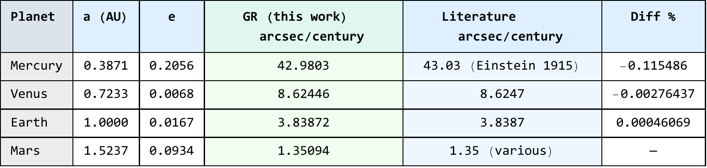
*Figure 12: Mathematica output table: GR precession per century for Mercury, Venus, Earth and Mars compared to literature values.*

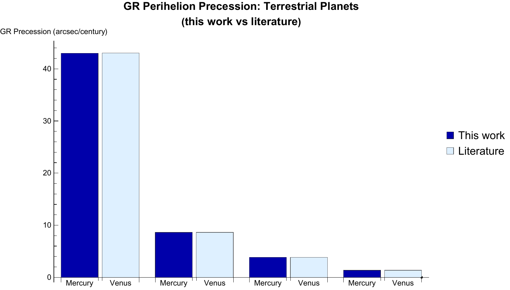
*Figure 13: GR precession rate decreasing with semi-major axis (Mercury dominates due to high eccentricity and proximity to the Sun).*

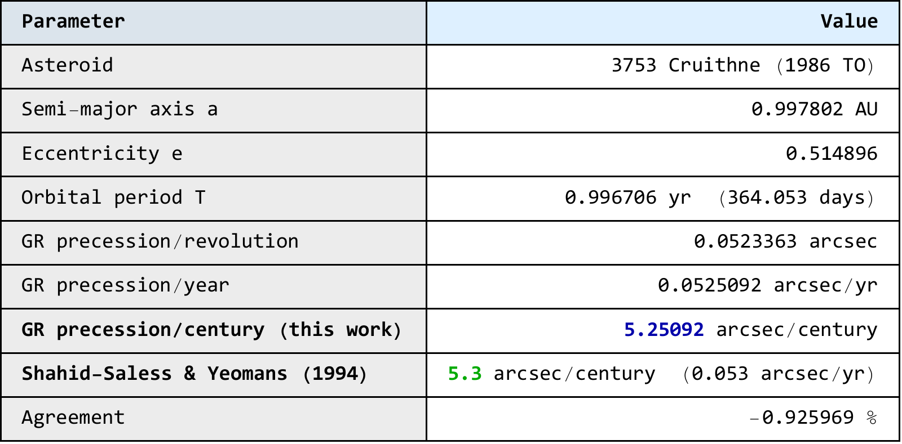
*Figure 14: Cruithne GR precession summary: 5.251″/century (this work) vs. 5.3″/century (literature); agreement −0.93 %.*

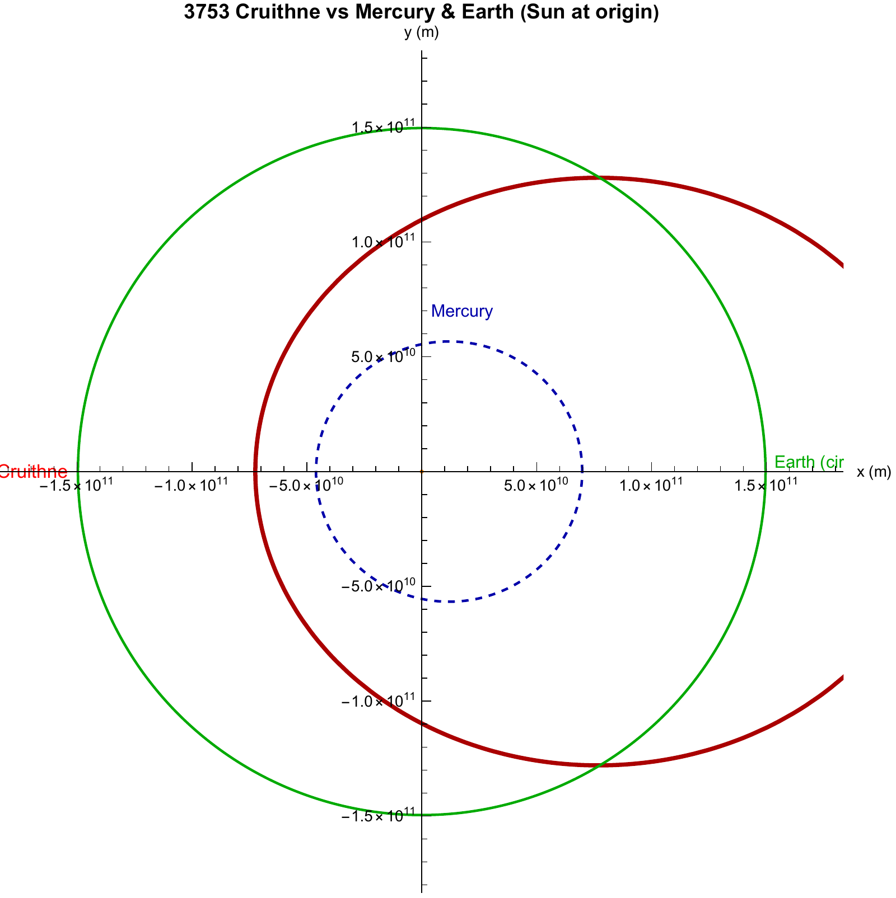
*Figure 15: Cruithne's orbit (blue) compared to Mercury's (black) to scale, illustrating its Earth-crossing, high-eccentricity path.*

Additional figures in `figures/`, used in the slides:
- `PLOTNumAnalytc`: numerical vs analytical radial solution
- `rSolPLOT1B`: radial coordinate r(t) over the last orbital period
- `Q2-precession-sources-log-bar`: precession sources on a log scale
- `bonus-planet-contributions-bar`: per-planet contribution to the non-relativistic precession
- `bonus-GR-vs-eccentricity`, `bonus_comparison_table`, `planet-mass_table`, `precession-baseline-table`

## Repository contents
- `notebooks/`: Wolfram Language Jupyter notebooks (outputs saved, so results display directly on GitHub)
- `report/`: written report (PDF)
- `figures/`: report and slide figures (PDF originals with PNG copies for display on GitHub)

## How to run
The notebooks use the Wolfram Language kernel for Jupyter (WolframLanguageForJupyter, Wolfram Engine or Mathematica 14).

## Credits
This project was completed on a course notebook framework by **Prof. Fabrizio Pinto** (Izmir University of Economics), released under CC BY 4.0. The completed notebook, results and written report in this repository are my own work.

## License
CC BY 4.0, consistent with the original course material. Please credit both Prof. Fabrizio Pinto and Kaoutar Ammara.

---
Kaoutar Ammara · Aerospace Engineer · [GitHub](https://github.com/Kiwiiiieee) · [LinkedIn](https://linkedin.com/in/kaoutar-ammara)
