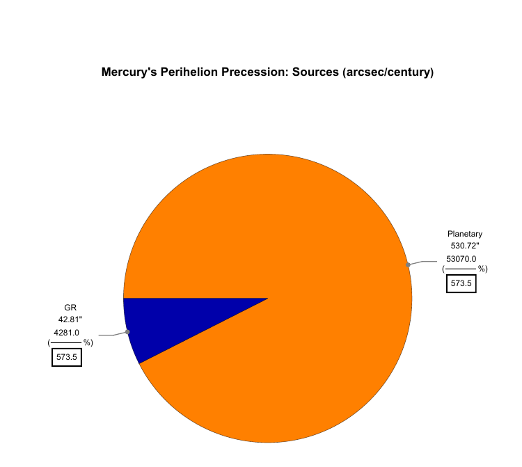

# Mercury's Perihelion Precession: Numerical Study

*Individual project · AE 442 · Izmir University of Economics · May 2026*

## Engineering question
Can Mercury's observed perihelion precession be reproduced numerically and attributed to its physical sources?

## Approach
- One-century integration of the equations of motion.
- Planetary perturbations (rings of mass), the general-relativistic correction and solar oblateness added sequentially.
- A spurious numerical baseline from finite-difference truncation characterised and subtracted from every run.

## Results
- Total precession of 573.5 arcsec/century against 574.8 observed (0.22%).

## Validation
Benchmark comparison; residual attributed to omitting Uranus and Neptune.

## Repository contents
- `notebooks/`: Wolfram Language Jupyter notebooks (outputs saved, so results display directly on GitHub)
- `report/`: written report (PDF)
- `figures/`: key figures

## How to run
The notebooks use the Wolfram Language kernel for Jupyter (WolframLanguageForJupyter, Wolfram Engine or Mathematica 14).

## Credits
This project was completed on a course notebook framework by **Prof. Fabrizio Pinto** (Izmir University of Economics), released under CC BY 4.0. The completed notebook, results and written report in this repository are my own work.

## License
CC BY 4.0, consistent with the original course material. Please credit both Prof. Fabrizio Pinto and Kaoutar Ammara.

---
Kaoutar Ammara · Aerospace Engineer · [GitHub](https://github.com/Kiwiiiieee) · [LinkedIn](https://linkedin.com/in/kaoutar-ammara)
